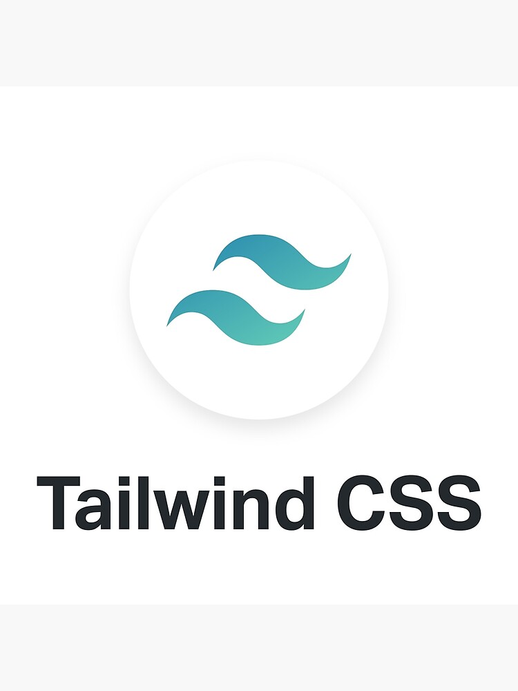

# About the Project:
 todo list application: it helps you to manage your personal and professional productivity.

 [Live Demo](https://weather-iapv.vercel.app/)
 

 ## Features:
1. Create, edit, and remove tasks
2. Each task has name, description, due date, and importance
3. Filter tasks by comleted and not completed task
4. tasks are saved using localStorage

 ## Technologies Used:

  
  ## Library Used:
  1. i18next 
  2. UUID
  3. local storage API
  4. react hook form
