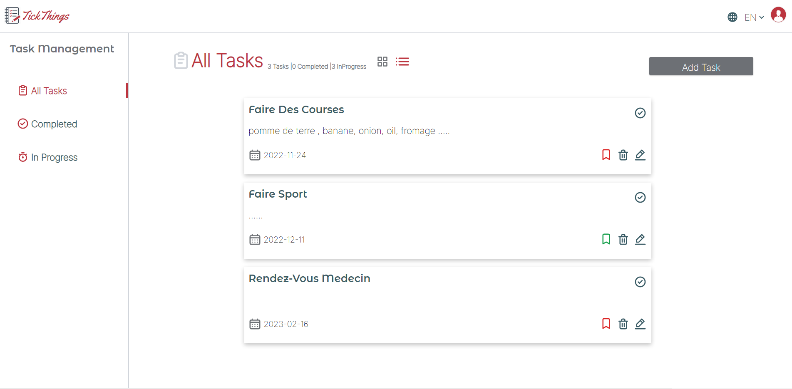

# About the Project:
TickThings application: it helps you to manage your personal and professional productivity tasks.

## For test:
 email: admin@admin.com

 psw: 123456789

 [Live Demo](https://todo-list-psi-ten.vercel.app/)
 

 ## Features:
1. Create, edit, and remove tasks
2. Each task has name, description, due date, and importance
3. Filter tasks by comleted and not completed task
4. tasks are saved using localStorage

 ## Technologies Used:
   
  1. reatJs
  2. Redux-Toolkit
  3. Tawilwind 
  4. React-router
  5. UUID
  6. localstorage API
  7. react-hook-form
  8. react-i18next
  9. react-toastify
